I cross-referenced the IOCs (Indicators of Compromise) and malware functionalities (like the use of RPC in ORPCBackdoor) across these three reports to build a unified profile of the threat actor's evolution from 2022 to the present.
1. What is the primary name of the APT group described in the SecureList report?
Kaspersky Global Research and Analysis Team (GReAT). (2023). Mysterious Elephant APT: TTPs and Tools. Securelist. Available at: https://securelist.com/mysterious-elephant-apt-ttps-and-tools/117596/
Soln: Mysterious Elephant

2.According to the Knownsec 404 team's analysis(Evidence -3), since which year has this group's attack activity been dated back to?
Soln: 2022

3.The group uses a custom backdoor that communicates via Office Remote Procedure Call (ORPCBackdoor). According to the Knownsec 404 team's analysis(Evidence -2), what is the name of the first malicious exported entry function?
According to the analysis by the Knownsec 404 team (Evidence 2), the ORPCBackdoor has two malicious entries. The first malicious exported entry function is:

GetFileVersionInfoByHandleEx(void)
The report notes that while the backdoor uses a total of 17 export functions to mimic the legitimate Windows version.dll (for DLL hijacking purposes), this specific function and the DllEntryPoint are the actual locations where the malicious logic is triggered

Soln: GetFileVersionInfoByHandleEx(void)
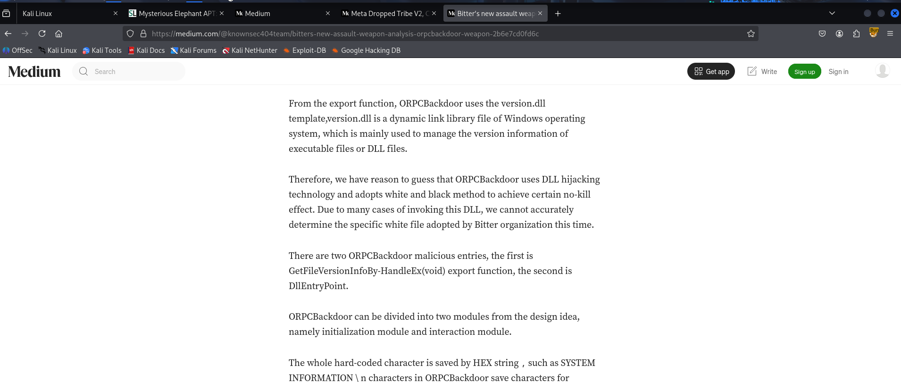
4.The previously mentioned backdoor checks for a file before creating persistence. What is the name of the file?
Based on the Knownsec 404 team's analysis (Evidence 2), before creating persistence, the ORPCBackdoor checks for the presence of a file named:

ts.dat
Soln: ts.dat
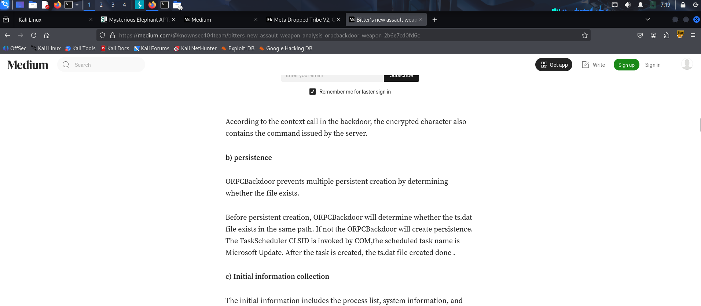
5.The use of the backdoor links the APT to another well-known South Asian APT group. What is the name of this other group?
The use of the ORPCBackdoor directly links Mysterious Elephant (APT-K-47) to the well-known South Asian APT group called Bitter (also known as APT-C-08 or T-APT-17
 Soln: Bitter
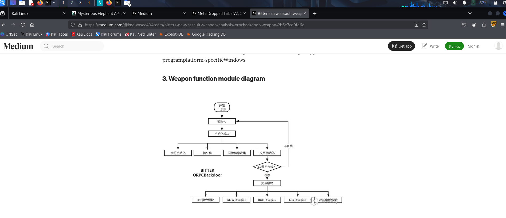
6.The APT group we are currently investigating has consistently used and updated another backdoor since 2023, with its C2 communication evolving from TCP to HTTPS. What is the name of this tool?
According to Evidence 3, which is the Knownsec 404 report titled: "Unveiling the Past and Present of APT-K-47 Weapon: Asyncshell."
4.1 Discover Asyncshell for the first time

Our team first discovered Asyncshell back in January 2024, when we found a malicious sample exploiting the CVE-2023–38831 vulnerability, with the overall attack chain shown below:

Soln: Asyncshell-v2
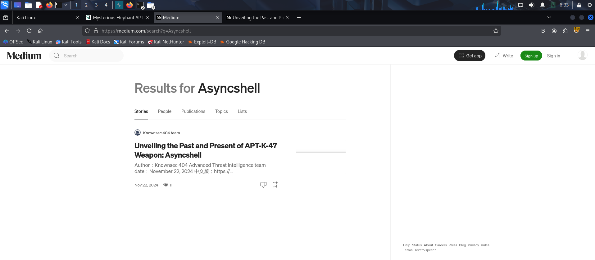
7.To evade sandbox analysis, the MemLoader HidenDesk tool checks the number of active processes before running. What is the minimum number of processes required for it to proceed?
According to the analysis in the provided SecureList report (Evidence 1), the MemLoader HidenDesk tool implements a specific check to identify sandbox or emulation environments.

The malware checks the number of active processes on the system and will terminate itself if there are fewer than 40 processes running. Therefore, the minimum number of processes required for the tool to proceed with its malicious activity is 40
Soln: 40
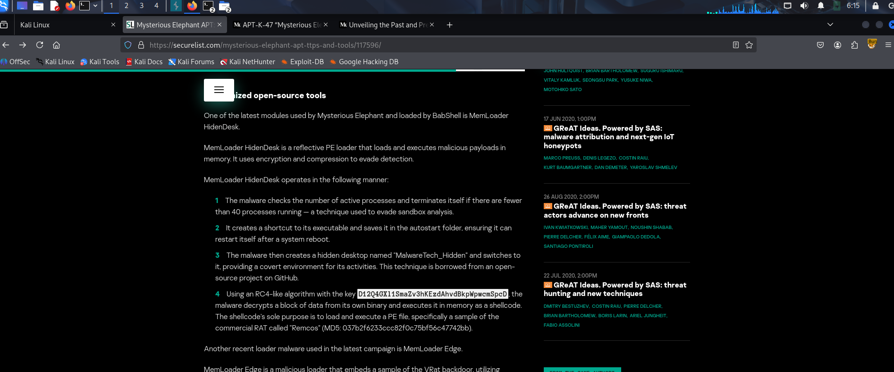

8. The MemLoader HidenDesk tool creates a covert environment for its activities by creating and switching to a specific environment. What is the name of this hidden desktop?
According to the first evidence:
 The malware then creates a hidden desktop named “MalwareTech_Hidden” and switches to it, providing a covert environment for its activities. This technique is borrowed from an open-source project on GitHub.
Soln: MalwareTech_Hidden
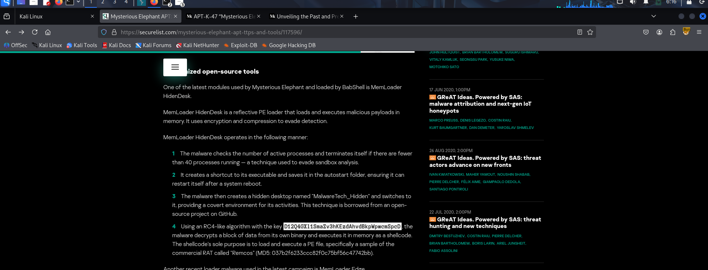

9. The MemLoader HidenDesk tool achieves persistence by placing a shortcut in the autostart folder to ensure it runs after a system reboot. What is the MITRE ATT&CK ID for the 'Registry Run Keys / Startup Folder' technique?
Context from the Investigation:
As noted in the SecureList report (Evidence 1), the MemLoader HidenDesk tool specifically utilizes this technique by creating a shortcut to its executable and saving it in the Windows autostart folder. This ensures that the malware automatically restarts every time the system is rebooted, a core part of the Persistence tactic.
Soln:T1547.001
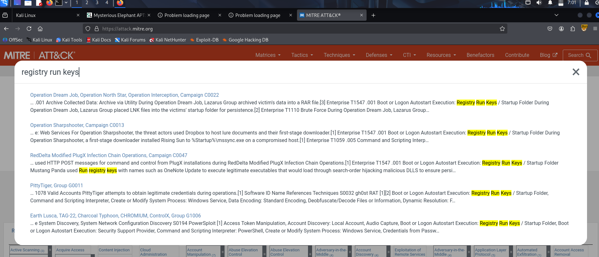
10.The actor uses several custom exfiltration tools targeting WhatsApp. What is the name of the tool that recursively searches specific directories, including the “Desktop” and “Downloads” folders?
According to the SecureList report (Evidence 1), the Stom Exfiltrator is a specialized tool that performs recursive searches to collect files with predefined extensions.
Soln: Stom Exfiltrator
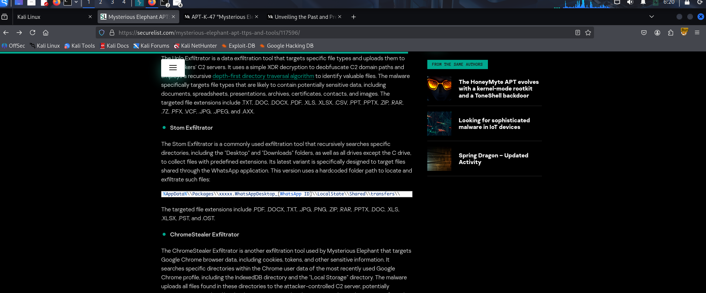
11.Kaspersky's analysis highlights the actor's heavy use of scripts for execution and deploying payloads. What is the MITRE ATT&CK ID for the 'PowerShell' technique?
Context from the Investigation:
As highlighted in Kaspersky's analysis of Mysterious Elephant (APT-K-47), the group makes heavy use of PowerShell scripts to execute commands and deploy secondary payloads. This falls under the broader Command and Scripting Interpreter technique (T1059).

The use of PowerShell allows the group to "live off the land" (using legitimate system tools to perform malicious actions), which often helps in evading detection by blending in with normal administrative activity. In their campaigns, these scripts are frequently used to download next-stage payloads from C2 servers and establish system persistence
Soln: T1059.001
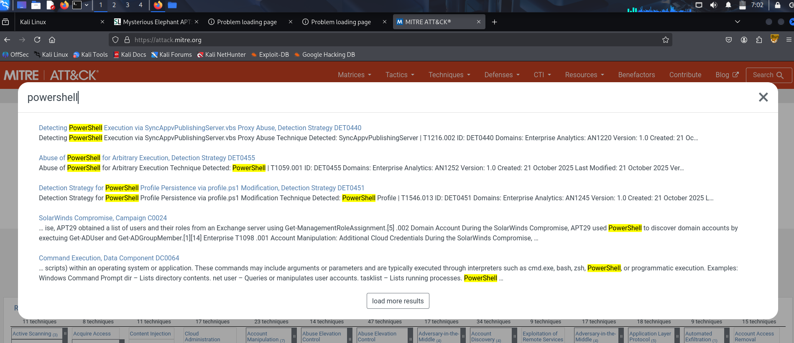
12.In their early attack chains, Mysterious Elephant used a downloader that was previously associated with the Origami Elephant group. What was the name of this downloader?
According to Kaspersky's research (Evidence 1.2), this downloader was previously connected to the Origami Elephant group (also known as the DoNot Team) and had been abandoned by them before being adopted and reused by Mysterious Elephant. This reuse of abandoned tools was one of the key factors that initially led researchers to believe there was deep collaboration or resource sharing between South Asian APT groups like Origami Elephant, Confucius, and SideWinder.

Soln:Vtyrei
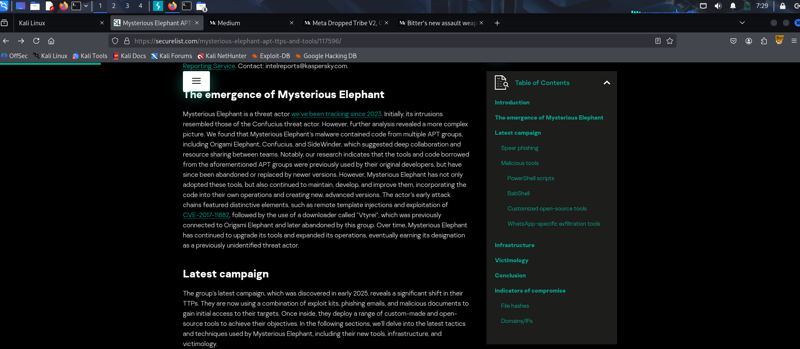
13.In a January 2024 campaign delivering an Asyncshell payload, which CVE was exploited in the malicious archive file?
In the campaign first discovered in January 2024, Mysterious Elephant (APT-K-47) delivered the Asyncshell-v1 payload by exploiting a high-profile vulnerability in WinRAR.

Soln: CVE-2023-38831
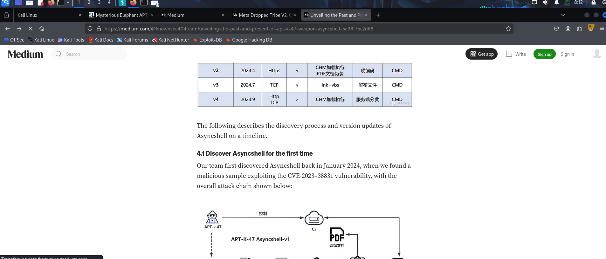
14.What is the MD5 hash of the ChromeStealer Exfiltrator sample named WhatsAppOB.exe?
Based on the Kaspersky Securelist report, the MD5 hash for the ChromeStealer Exfiltrator sample named WhatsAppOB.exe is:

9e50adb6107067ff0bab73307f5499b6
Soln: 9e50adb6107067ff0bab73307f5499b6
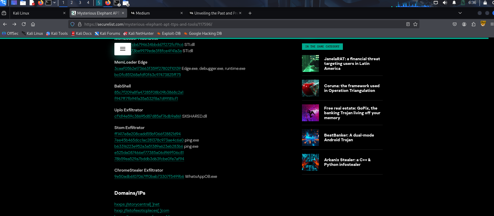

15. The intelligence describes multiple custom tools designed to upload stolen data to the actor's servers. According to the MITRE ATT&CK framework, what is the ID for the 'Exfiltration Over C2 Channel' technique?
Context from the Investigation:
This technique is a hallmark of the Mysterious Elephant (APT-K-47) group's operations. Rather than setting up separate exfiltration channels, their custom tools—such as Asyncshell-v2, ChromeStealer, and the Uplo Exfiltrator—are designed to funnel stolen sensitive data (including documents and WhatsApp communications) back to the same infrastructure used for command and control. This allows the actor to blend their data theft in with existing malicious traffic, making it harder for defenders to distinguish the exfiltration phase from standard remote access activity.
Soln: T1041

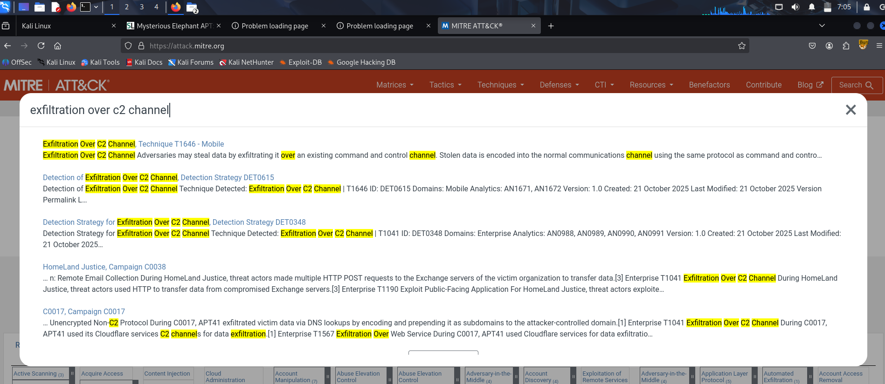
